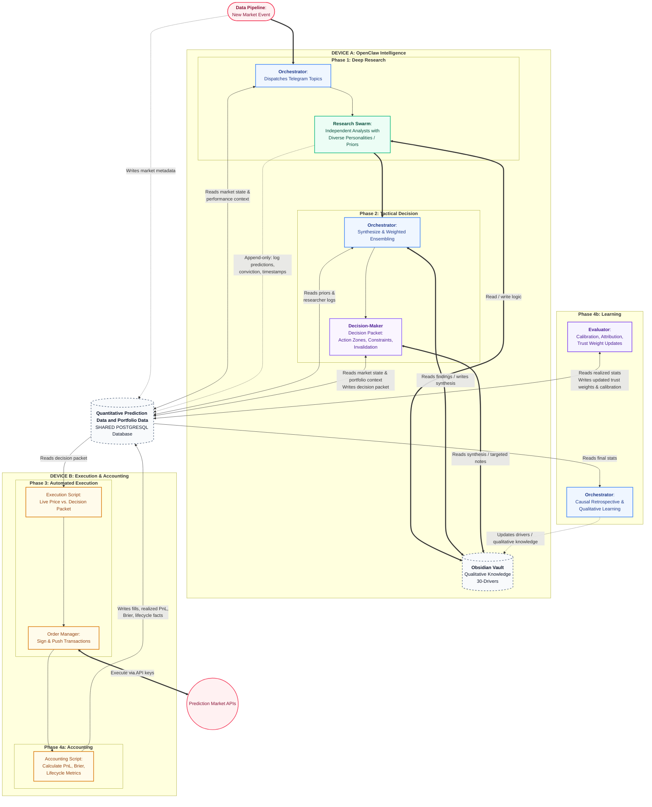

# Prediction Quant Reasoning Pipeline Workspace

This workspace is the control plane and memory substrate for a multi-agent prediction-market / quantitative research pipeline.

At a high level, the system is split into two complementary databases:

- **Vault / Obsidian vault** → the **qualitative database** for reasoning, provenance, syntheses, retrospectives, and durable domain/entity/driver knowledge
- **PostgreSQL** → the **quantitative database** for market state, portfolio state, execution state, outcomes, calibration, attribution, and agent-weight data

The qualitative database is the human-readable reasoning layer.
The quantitative database is the structured measurement and state layer.

The Vault is **not** the forecast ledger or execution engine.
PostgreSQL is **not** the primary home for narrative reasoning, source extraction, or qualitative memory.

In other words:

- if the system needs to answer **why we thought something**, **what evidence we used**, or **what lesson we learned**, that belongs in the **qualitative database**
- if the system needs to answer **what happened numerically**, **what was executed**, **how an agent performed**, or **what the portfolio state is**, that belongs in the **quantitative database**

This split is intentional. It keeps the system interpretable for humans and LLMs without sacrificing structured evaluation and execution state.

## Current research execution surface

The live research swarm currently executes through **Telegram forum topics**.

Operationally:
- planner/control-plane logic lives in this repo
- OpenClaw runtime creates one controller topic plus one persona topic per case for the researcher swarm and delivers assignments into those topic sessions
- once the active dispatch is truly terminal, synthesis promotion creates one dedicated synthesis topic for that dispatch and runs the final synthesis there
- researchers and synthesis write artifacts back into `qualitative-db/40-research/`
- PostgreSQL tracks market, case, dispatch, and research-run state

See:
- `runtime/researchers-swarm-subagents/README.md`
- `runtime/synthesis-subagent/README.md`
- `scripts/README.md`
- `scripts/AUTOMATION_CONTROL.md`
- `scripts/launchd/README.md`

## Architecture status note

The diagram below mixes:
- the **currently live and operator-tested path**, and
- the **broader target end-to-end architecture**.

Today, the most concretely implemented and tested path is:
- market metadata and pipeline state in PostgreSQL
- case opening and `research_runs` creation
- Telegram-topic researcher-swarm dispatch via the OpenClaw runtime
- researcher-sidecar generation and dispatch-scoped artifact output into `qualitative-db/40-research/`
- run-level completion reconciliation
- terminal-only dispatch finalization and single-flight synthesis launch into a dedicated synthesis topic
- final synthesis rendering into canonical case-level synthesis artifacts
- dedicated Decision-Maker lane launch, decision-packet validation/rendering, and forecast-ledger persistence
- bounded sequencer / watchdog / health-check supervision around the active one-case-at-a-time pipeline

Execution, accounting, evaluator, and trust-weight loops are already represented in the repo schema/docs, but they are comparatively less operationally mature than the research -> synthesis -> decision control-plane path.

## Core architecture

## How the pipeline works

## Phase 0: External trigger
A separate data pipeline identifies a new high-value market event and writes initial market metadata into PostgreSQL.

This is the entry point into the intelligence pipeline.

## Phase 1: Deep research
The **Orchestrator** decides that the market is worth work, scopes the case, and dispatches the research swarm into fresh Telegram persona topics.

The research swarm is best thought of as **multiple independent analysts performing the same general research task under different personalities, priors, and temperaments**, rather than a rigid set of specialist functions.

Examples of useful diversity:
- more skeptical vs more constructive framing
- base-rate-heavy vs narrative-heavy interpretation
- more aggressive vs more conservative weighting
- faster exploratory vs slower careful synthesis style

Researchers primarily interact with:
- the **Vault**, which acts as the qualitative database for note-taking, provenance, assumptions, and synthesis inputs
- **PostgreSQL**, which acts as the quantitative database for append-only prediction logs, conviction, timestamps, and later performance linkage

Researchers should normally write into `qualitative-db/40-research/`, not stable canonical layers.

## Phase 2: Tactical decision
The **Orchestrator** reviews the research outputs and produces a synthesized view.

Then the **Decision-Maker**:
- reviews the synthesis and selected underlying notes
- checks structured market context in PostgreSQL
- produces a **decision packet**

A decision packet should include things like:
- action zones
- constraints
- invalidation logic
- other execution-relevant conditions

That decision packet is stored in PostgreSQL as structured state.

## Phase 3: Automated execution
In a separate isolated execution environment, a monitor script watches live prices against the decision packet.

If conditions are met:
- the **Order Manager** signs and pushes transactions through prediction-market APIs
- execution and fills are recorded
- the **Accounting** layer computes realized PnL, Brier, and other lifecycle metrics

Execution is intentionally separated from OpenClaw intelligence so the reasoning environment does not directly control private keys or execution infrastructure.

## Phase 4a: Quantitative learning
The **Evaluator** reads realized stats from PostgreSQL and updates:
- calibration metrics
- attribution metrics
- trust weights
- other quantitative performance measures

This is the structured evaluation loop.

## Phase 4b: Qualitative learning
The **Orchestrator** reads final stats and runs a retrospective.

The retrospective should answer:
- what actually mattered?
- what misled the pipeline?
- which sources or assumptions were useful or harmful?
- what should change in future research?
- which durable lessons should update `30-drivers` or other qualitative memory?

This is the qualitative learning loop.

## Responsibilities by component

### Orchestrator
Owns the control plane:
- selects cases
- dispatches researchers into fresh Telegram persona topics
- synthesizes research
- triggers retrospectives
- maintains qualitative memory and promotes durable lessons carefully

### Research swarm
Owns parallel evidence generation:
- independent analysis of the same case
- divergent framing driven by different personalities / priors
- explicit disagreement and alternative weighting
- structured findings in `qualitative-db/40-research/`

### Decision-Maker
Owns the final suggested action:
- validates or challenges the orchestrator synthesis
- checks bounded market / decision context
- emits the structured decision packet

### Evaluator
Owns quantitative performance review:
- calibration
- attribution
- trust-weight updates
- cross-lifecycle measurement

### Vault
Owns the **qualitative database**:
- provenance
- source notes
- syntheses
- assumptions
- retrospectives
- stable domains / entities / drivers
- human-readable causal and contextual memory

Start at `qualitative-db/README.md` for the memory-system map.

### PostgreSQL
Owns the **quantitative database**:
- market metadata
- researcher prediction logs
- decision packets
- fills and PnL
- lifecycle metrics
- calibration history
- trust weights
- portfolio state
- evaluator-ready structured measurement state

### Execution environment
Owns action and accounting:
- reads the structured decision packet
- executes against market APIs
- records fills and realized metrics
- remains isolated from the OpenClaw reasoning environment

## Design principles

- **Qualitative and quantitative databases stay separate**
  - Vault = qualitative database for reasoning, provenance, and durable interpretation
  - PostgreSQL = quantitative database for state, execution, and evaluation

- **Researchers write to research first**
  - new evidence belongs in `qualitative-db/40-research/`
  - stable layers update only under stronger review thresholds

- **Human remains in the loop**
  - the system is a decision-support and execution architecture, not an unbounded autonomous black box

- **Execution is isolated from reasoning**
  - private keys and trade execution should not live in the same environment as the research swarm

- **Retrospectives drive durable learning**
  - structured metrics update quantitative trust
  - qualitative retrospectives update drivers and other durable memory

## Repository orientation

Current key top-level areas:

- `qualitative-db/` → qualitative database / research memory system
- `quant-db/` → PostgreSQL schema, migrations, and DB helper scripts for the structured state layer
- `roles/` → role-specific operating docs, dispatch specs, and device-specific pipeline scripts
- `memory/` → assistant continuity / daily memory
- `MEMORY.md` → compact long-term assistant memory
- `qmd.yml` → retrieval/index configuration for the vault

The live PostgreSQL database itself is runtime infrastructure, not a file that belongs in git.

## Current status

This repository now contains both:
- a substantial qualitative vault in `qualitative-db/`, and
- an initial but real quantitative/control-plane scaffold in `quant-db/` and `roles/`

What remains early-stage is not the existence of the structured layer, but its operational depth.
The current Postgres and dispatch stack is sufficient for:
- schema/bootstrap and migrations
- market intake and pipeline-state tracking
- case opening and research-run bookkeeping
- OpenClaw-runtime dispatch planning and runtime/session metadata handoff

The larger remaining buildout is the downstream execution, accounting, calibration, and evaluation maturity — not the initial presence of the quant/control-plane architecture.
